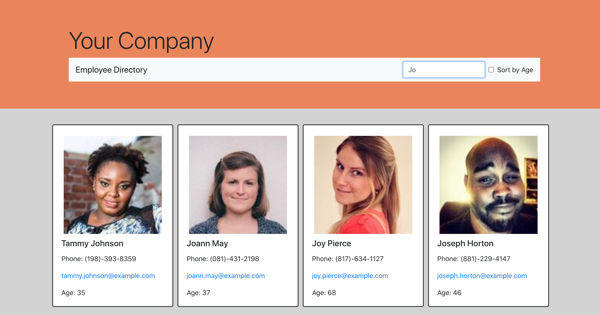
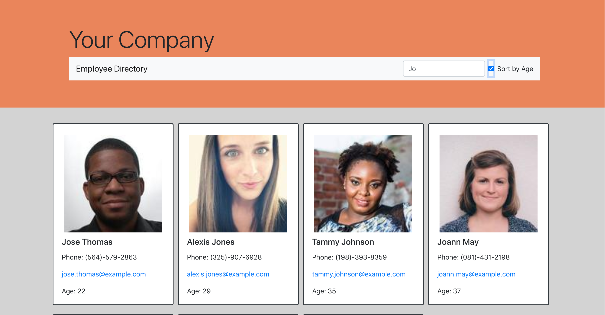

# Employee-Directory

  

  ## Description

    Operating a business and its many employee can become a cumbersome task - the ability to filter or sort the employees helps analyze more efficiently. In this application, the user enters the site containing 200 "employees"(provided by 'random user' api). Rather than sifting through all 200 employees, the user may filter by name or sort by the age of the employee - or both in conjunction.

    Using React, I broke up the application's UI into components, then managed the component state in order to respond to the user's events. I utilized the CSS framework Bootstrap for simple, efficient styling.

  ## Table of Contents

  * [Installation](#installation)

  * [Usage](#usage)

  * [License](#license)

  * [Contributing](#contributing)

  * [Tests](#tests)

  * [Questions](#questions)

  ## Installation
  To install the necessary dependencies, run the following command:
  
  npm i

  ## Usage
  
  [Deployed Link]()

  ## License

  This project is not licensed

  ## Contributing

  [Joshua Homer](https://github.com/Jchomer90)

### Update you budget with any transaction made, if made offline the total will update once online

  ## Questions
  If you have any questions about the repository, open an issue or contact me directly at Joshuachomer@gmail.com.
   You can also find more of my work on [Github](www.github.com/Jchomer90)
  # Budget-Tracker